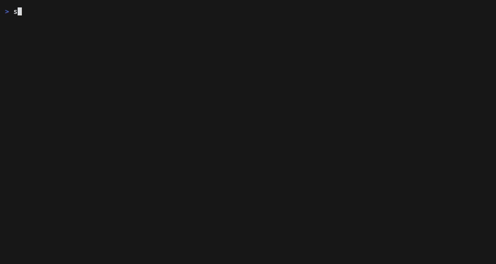

# sctui — a terminal dashboard for Scalable Capital

[](https://github.com/Smileodox/sctui/actions/workflows/ci.yml)
[](https://www.npmjs.com/package/@smileodox/sctui)
[](LICENSE)

🇩🇪 [Deutsche Version](README.de.md)

A terminal dashboard for your Scalable Capital portfolio, built on the
official [Scalable CLI](https://github.com/ScalableCapital/scalable-cli).
Overview, positions, savings plans, watchlist, transactions with per-order
detail, an instrument pane with chart, quote and news — auto-refreshing.

> **Unofficial project.** Not affiliated with or endorsed by Scalable Capital
> GmbH. Not investment advice — figures can be wrong, incomplete or delayed.
> The current version is strictly **read-only**: it cannot place orders or
> change anything in your account
> ([how that is enforced](#read-only-by-construction)).



*Recorded against `sctui --demo` — generated data, no account needed.
Reproducible with [`vhs assets/demo.tape`](assets/demo.tape).*

## Quick start

No account, no CLI, no risk — sample data:

```sh
npx @smileodox/sctui --demo
```

For live data you need the official CLI (you install it and log in yourself —
sctui never does this for you):

```sh
brew tap ScalableCapital/tap
brew trust --formula ScalableCapital/tap/scalable-cli
brew install scalable-cli
```

Then enable **"Scalable CLI"** in your Scalable profile under
**Settings → Security**, and:

```sh
sc login --local-read-only   # OAuth device code in the browser
sc whoami                    # check the session works
```

`--local-read-only` stores the session itself in read-only mode: the official
binary then refuses any mutation, no matter what a program above it asks for.
sctui recommends this login and — in its current version — never issues
anything a read-only session would refuse. Its
[own allowlist](#read-only-by-construction) is the second line of defence,
not the only one.

Finally:

```sh
npm install -g @smileodox/sctui
sctui
```

## Language & formats

The UI is English by default. With a German locale (`LANG=de_DE.UTF-8` or
`SCTUI_LOCALE=de-DE`) every label, hint and number format switches to German.
The same locale drives number, date and currency formatting, so labels and
formats always agree.

## Usage

```
sctui [options]

  --demo                 Sample data instead of real (no sc, no account needed)
  --refresh <seconds>    Auto-refresh interval (default: 60, minimum: 5)
  --no-refresh           Disable auto-refresh
  --tab <name>           Start tab: overview | holdings | savings | watchlist | transactions
  --sc-bin <path>        Alternative path to the sc binary
  --no-alt-screen        Render in the normal buffer (useful for debugging)
  -h, --help             Help
  -v, --version          Version
```

`SCTUI_SC_BIN` sets the binary path, `SCTUI_LOCALE` the language and number
format.

## Keys

| Key | Action |
| --- | --- |
| `1` – `5` | Jump to tab |
| `tab` / `⇧tab` | Next / previous tab |
| `↑` `↓` · `j` `k` | Move selection |
| `g` / `G` | Top / bottom of list |
| `pgup` / `pgdn` | Page up / down |
| `⏎` · `→` · `l` | Open detail for the selected row |
| `esc` · `←` · `h` | Close detail |
| `[` `]` · `t` | Chart timeframe back / forward / cycle |
| `n` | Chart ↔ news in the detail pane |
| `r` | Refresh now (bypass cache) |
| `a` | Auto-refresh on / off |
| `/` | Instrument search |
| `d` | Raw JSON of the current view |
| `?` | Help |
| `q` · `ctrl-c` | Quit |

## Read-only, by construction

The current version of sctui cannot run a mutating `sc` command — no trading,
no watchlist edits, no price alerts. Enforced in
[`src/sc/exec.ts`](src/sc/exec.ts):

- Command path and flags are passed **separately** (`runSc(path, args)`). The
  path is compared against an allowlist **exactly**, not as a prefix —
  `broker watchlist` is allowed, `broker watchlist add` is not.
- A blocklist additionally rejects confirmation flags (`--confirm`,
  `--accept-unsuitable`, `--yes`, `-y`), in both `--flag` and `--flag=value`
  form.
- Every call goes through `assertReadOnly()` before a process is spawned.
- [`tests/exec.test.ts`](tests/exec.test.ts) proves all of this in CI, and
  [`scripts/check-readonly-boundary.mjs`](scripts/check-readonly-boundary.mjs)
  fails the build if `child_process` appears anywhere in `src/` outside
  `exec.ts` — there is no path around the allowlist.

How to audit this yourself in five minutes: [SECURITY.md](SECURITY.md).

Whether sctui stays read-only forever is an open product question. If write
features ever land, they will be opt-in, separately guarded, and clearly
released as such — the guarantee above describes every version that carries
it in its README.

## What the CLI provides

Every `--json` response comes in an envelope:

```json
{ "ok": true, "command": "broker.overview", "data": { "result": { } } }
{ "ok": false, "command": "broker.search", "error": { "code": "…", "message": "…" }, "hints": [] }
```

Two details worth knowing:

- **Failures arrive with exit code 0.** `ok: false` is the only signal —
  [`unwrapEnvelope()`](src/sc/json.ts) inspects the parsed document, not the
  exit status.
- **`broker chart` has no `result`.** Its series sits directly in
  `data.data_points[]`; `overnight` in turn is a top-level command (not
  `broker overnight`) and puts its `display_name` *next to* `result`.

Timeframes for chart and quote: `1d`, `7d`, `1m`, `3m`, `6m`, `ytd`, `1y`,
`max`.

Some figures are computed client-side because the CLI does not report them:
`broker overview` only carries a money amount per timeframe
(`simpleAbsoluteReturn`), so the overview's percentages are derived. And
`broker holdings` has no day change — that column comes from one
`broker quote` per ISIN, same for the watchlist.

### When a column shows `—`

The field names in [`src/sc/normalize.ts`](src/sc/normalize.ts) are verified
against `sc 1.0.0`, but still live in alias tables (`PRICE_KEYS`,
`PNL_PCT_KEYS`, …) so a rename upstream degrades one column instead of
emptying the screen. Case and separators are ignored: `totalValue`,
`total_value` and `TOTAL-VALUE` all match. Nested fields use dot paths
(`day_change.percent`).

If a column stays empty although the data must be there:

1. Press `d` — the overlay shows the raw JSON plus the exact `sc` command.
2. Find the real key.
3. Add it to the matching alias list in `normalize.ts`.

That is the intended path, not a workaround.

## Development

```sh
npm run dev          # tsx, against the real CLI
npm run demo         # tsx, sample data
npm run typecheck
npm test             # read-only guarantee: boundary check + unit tests
npm run build
```

**Layout checks without a TTY.** `scripts/snapshot.tsx` renders the app
against a virtual terminal of any size and prints the last frame:

```sh
npm run snapshot -- 120 30 holdings --keys='jj~'   # ~ = Enter, ^ = Escape
npm run snapshot -- 72 24 overview
```

`npm run check:layout` runs a matrix of 110 cases (sizes × tabs × overlays ×
failure modes) and fails when a frame is wider or taller than its terminal —
or when a marker string got overlapped. The reason for the effort: Ink does
not clip overflowing content, it wraps it. A component that renders one row
more than its `height` prop promises pushes its neighbour's rows over its
own, so every component keeps its own row budget and gives rows up instead
of letting them stack.

**Testing the live path without an account.** `scripts/fake-sc` is a shell
script that mirrors `sc 1.0.0`: same envelope, same field names, same command
structure. All four demo positions derive from one table inside the script,
so the header totals can never drift from the rows.

```sh
npm run snapshot -- 120 30 holdings --sc-bin="$PWD/scripts/fake-sc"
# failure paths: auth = error envelope on exit 0, exit = stderr and exit 1
FAKE_SC_FAIL=auth npm run snapshot -- 100 24 overview --sc-bin="$PWD/scripts/fake-sc"
FAKE_SC_FAIL=exit npm run snapshot -- 100 24 overview --sc-bin="$PWD/scripts/fake-sc"
```

### Layout

| Path | Contents |
| --- | --- |
| `src/sc/exec.ts` | Process wrapper, allowlist, timeouts, concurrency cap |
| `src/sc/json.ts` | Tolerant parsing and number coercion (`"1.234,56 €"` too) |
| `src/sc/normalize.ts` | Raw JSON → domain models, all field-name aliases |
| `src/sc/client.ts` | Commands, TTL caching, request dedup |
| `src/sc/mock.ts` | Demo data source (seeded, so prices stay stable) |
| `src/strings.ts` | Every user-facing string, English and German |
| `src/components/` | Table, Panel, Chart, Header, StatusBar, … |
| `src/views/` | The four tabs, detail pane, overlays |
| `src/app.tsx` | Keyboard, state, layout |

All width math goes through `pad()`/`truncate()` in
[`src/format.ts`](src/format.ts) instead of flex spacers: a flex spacer
collapses to zero and lets text run together instead of clipping it.

## Roadmap

Rough order — driven by what users actually ask for:

- **Price alerts (read view)** — with distance-to-trigger
- **Config file** — `~/.config/sctui` for refresh, tab, locale, theme
- **CSV/JSON export** — one-shot mode for scripting (`sctui export holdings`)

Missing something? [Open an issue](../../issues) — proposals that need a new
`sc` command are welcome, read-only ones land fastest.

## Limits

- Only as good as the CLI: when `sc` does not report something, sctui shows `—`.
- No ticker symbols, no venue, no day range — `broker quote` does not carry
  them. The identity line in the detail pane is therefore `ISIN · TYPE`, and
  the quote row shows bid, ask, previous close, spread and return since
  purchase.
- `overnight` is optional — without it the interest line in the cash tile
  stays empty.
- Below 80 columns, columns are dropped by priority; 100+ looks as intended.
  On narrow terminals the detail pane replaces the list instead of splitting.
- On very short terminals, views give up rows: the overview tiles lose their
  delta line first, then the label moves next to the number; below five
  content rows only a notice remains.
